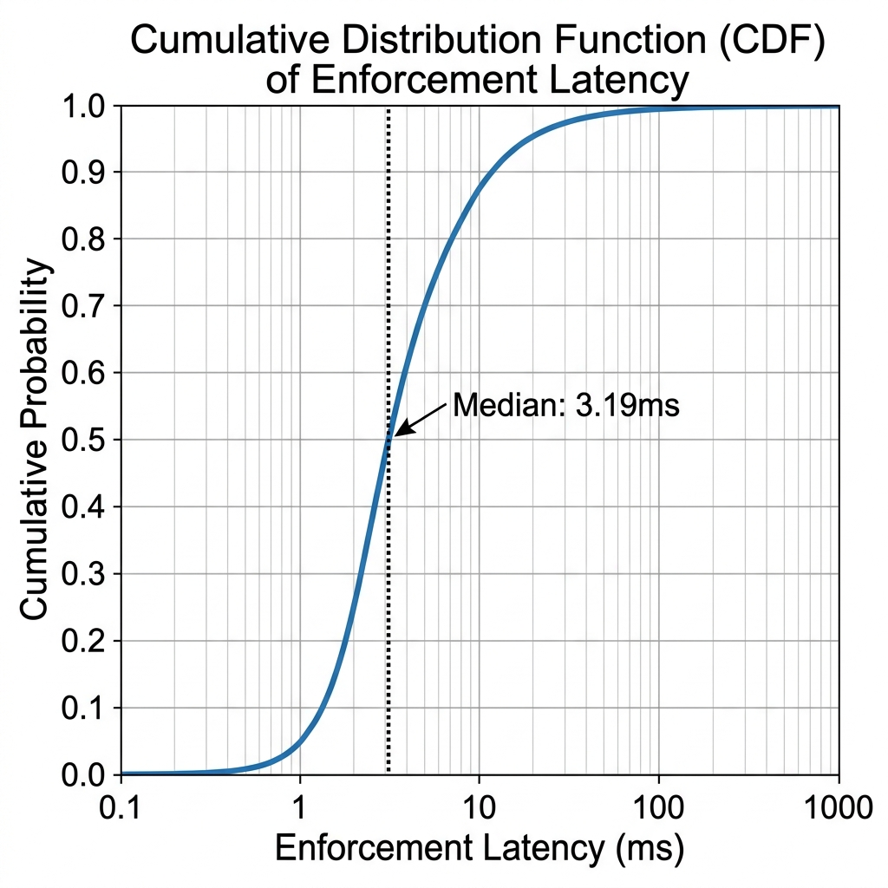
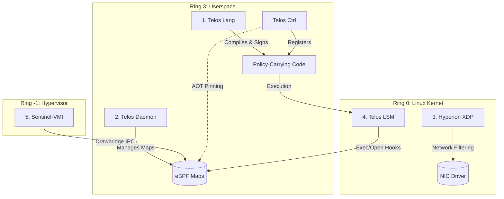

# Sentinel Stack v1.0-rc1

**Sentinel Stack** is a deterministic, multi-layered security runtime that entirely eliminates the **semantic-to-execution gap** for autonomous systems and AI agents. It enforces intent-based security policies from high-level semantics down to Ring -1 hypervisor isolation, preventing state corruption, kernel tampering, and network evasion.

<p align="center">
  
</p>

> [!TIP]
> **Performance Metrics**
> Our micro-benchmarks demonstrate an extremely tight "Blast Radius". Sentinel Stack achieves a **3.19ms median enforcement latency** across all intent-verification tasks, ensuring that autonomous AI agents are deterministic and safe without runtime bottlenecks.

---

## The Threat Model: Bridging the Semantic-to-Execution Gap

The primary vulnerability in modern AI deployments is the semantic-to-execution gap. High-level orchestrators evaluate AI "intent" purely in userspace text semantics, leaving the underlying operating system blind to whether the AI's actual system calls match the approved semantic intent.

Sentinel Stack eliminates this gap by mathematically verifying userspace intent at compile-time and cryptographically binding it to Ring 0 eBPF enforcement and Ring -1 hypervisor memory protection. If an agent's process behaves maliciously, the runtime enforces an absolute quarantine before the payload executes.

---

## Architecture: The 5 Pillars of Enforcement

Sentinel Stack is built upon a hardened, 5-Pillar Architecture bridging user space and hardware virtualization.



### 1. Telos Lang (Formal Verification)
A domain-specific intent language compiler (`telos-lang`) that mathematically proves security policies using **Z3 SMT solvers**. Upon `Sat` verification against global Information Flow Control (IFC) lattices, it generates an Ed25519 signature and injects it into a `.telos_pcc` ELF section, producing **Policy-Carrying Code (PCC)**.

### 2. Telos Runtime
The core intent verification engine and eBPF loader (`telos_daemon`). It manages the persistent pinned BPF maps (`/sys/fs/bpf/telos/`) and translates semantic permissions into kernel-level enforcement maps.

### 3. Hyperion XDP
An eBPF network firewall that intercepts all ingress and egress traffic at the NIC driver layer. It utilizes O(1) intelligence lookups (LPM tries) to instantly drop malicious domains, block command-and-control (C2) IPs, and prevent exfiltration attempts.

### 4. Telos LSM (eBPF Kernel Gate)
A Linux Security Module (LSM) written in eBPF that intercepts sensitive system calls (`execve`, `open`, `connect`). It enforces the Ahead-of-Time (AOT) registration of PCC binaries via synchronous O(1) cryptographic map lookups, preventing unsigned or tampered "Living-off-the-Land" binaries from executing.

### 5. Sentinel-VMI (Ring -1 Hypervisor)
The final hardware-backed quarantine layer. Sentinel-VMI communicates with the kernel via the secure **Drawbridge** IPC protocol to isolate compromised processes in Extended Page Tables (EPT), fully immune to Ring 0 exploits.

---

## Quick Start (Reproducible Build)

To build the entire Sentinel Stack natively from source, use the centralized orchestration Makefile.

### Prerequisites
- Linux kernel 5.15+ (with BTF and LSM BPF support)
- `clang` & `llvm`
- Go 1.21+
- Rust & `cargo`

### 1. Build the Stack

Clone the repository and run the monolithic build orchestration:

```bash
git clone https://github.com/nevinshine/sentinel-stack.git
cd sentinel-stack
make all
```

The root Makefile recursively generates BTF structures, compiles the eBPF objects, and orchestrates the Go binaries into the centralized `bin/` directory.

### 2. Initialize the Daemons

Start the security daemons to pin the maps and attach the eBPF hooks:

```bash
# Start Hyperion XDP Engine
sudo ./bin/hyperion_ctrl &

# Start Telos Runtime Daemon
sudo ./bin/telos_daemon &
```

### 3. Compile and Register Policy-Carrying Code (PCC)

Write your secure intent in `.telos` and compile it. The compiler will mathematically verify your constraints against the Z3 theorem prover and cryptographically sign the binary.

```bash
cd telos-lang
cargo run # Outputs dummy_signed.elf
```

Register the cryptographically signed binary via **Ahead-of-Time (AOT)** registration. This extracts the Ed25519 signature, verifies it, and pre-warms the kernel LSM map:

```bash
cd ../telos-runtime
sudo ./bin/telos_ctrl register ../telos-lang/dummy_signed.elf
```

### 4. Execute and Enforce

Execute the binary. The `bpf_lsm` hook will intercept the `execve` system call, perform an O(1) lookup on the binary's `inode`, and synchronously enforce the cryptographic allowance. Unsigned or unregistered binaries will be instantly severed with `-EPERM`.

---

## License
Sentinel Stack is licensed under the GPL-2.0 License.
