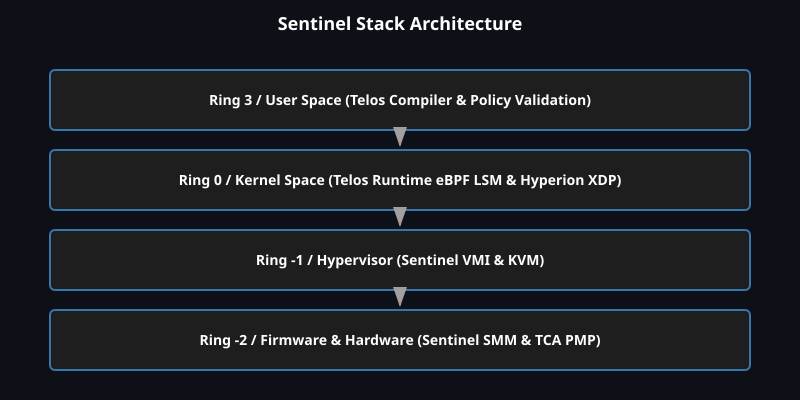
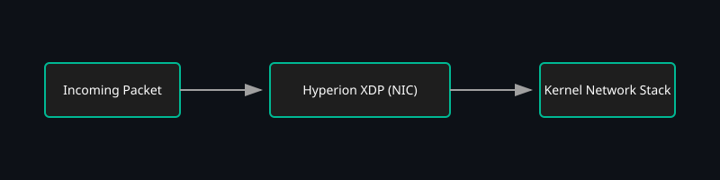
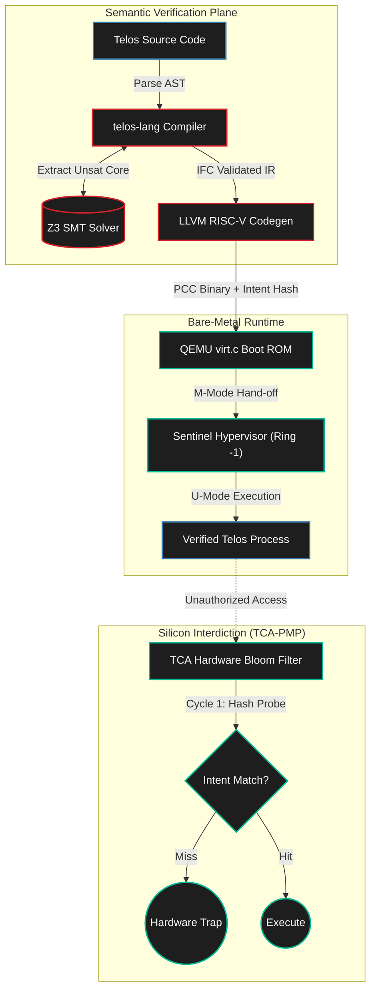
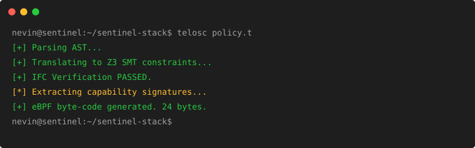

# Sentinel Stack (V2)

### Exploratory Hardware-Software Architecture for Intent-Bounded Execution

<p align="center">
  
  
  
  
  
  
</p>

> **Note:** This is an exploratory research prototype; security guarantees are experimental. Each subsystem is under development; see Maturity section.

The Sentinel Stack is an experimental systems architecture designed to constrain the semantic gap between high-level program intent and low-level hardware execution.

Traditional cybersecurity models often attempt to correlate high-level program intent with low-level execution context using software-mediated telemetry (e.g., eBPF, LSMs). This can result in non-deterministic enforcement and measurable runtime overhead. The Sentinel Stack explores hardware-bounded intent enforcement, replacing software-mediated hooks with an RTL-simulated hardware capability gate, intended to provide an order-of-magnitude reduction in mediation overhead.

---

## What is the Sentinel Stack? (The Simple Version)

Imagine a high-security manufacturing plant. In a traditional system, an inspector (the operating system kernel) stands at every door checking badges (permissions) whenever an employee (a program) tries to move a sensitive component. This slows down the entire factory.

Instead of relying on a runtime inspector at the door, the rules are mathematically constrained before the program executes, and the simulated hardware datapath is designed to trap unauthorized flows.

When a developer writes code in the Sentinel Stack, they declare their exact intent in natural language:
> *"I intend to read a secure cryptographic key and hash it."*

1. **The Math Layer:** Before the code is even compiled, a mathematical solver (Z3 SMT) verifies that the developer hasn't accidentally written code that leaks the key to the internet. If the constraints fail, the program refuses to compile.
2. **The Hardware Layer:** Once compiled, the program is handed a cryptographic "intent receipt." When the program runs on the simulated processor, a custom hardware gate checks the receipt with **simulated low-cycle overhead in RTL experiments**.

If the program attempts to break its promise—say, by opening a network socket to exfiltrate the key—the simulated hardware trap deterministically drops the connection within measured latency bounds. The operating system isn't even asked for permission. The enforcement is modeled directly at the architectural level.

---

## Architecture & Technical Deep Dive

The V2 Architecture prototypes an intent-bounded pipeline spanning from compiler semantics to a virtualized hardware model. 







### 1. Bounded Formal Verification (Z3 SMT)
The `telos-lang` compiler integrates the **Z3 SMT solver** directly into the compilation pipeline. Using **Linear Temporal Logic (LTL)** constraints and an **Information Flow Control (IFC)** lattice, the compiler asserts that specific taint propagation rules hold. If the SMT solver identifies a violation, compilation halts and extracts an Unsat Core pointing to the exact line in the AST where the constraint failed. 

### 2. Privilege Transitions & Enforcement
The compiler lowers parsed `intend network` blocks into highly specific U-mode `ecall` sequences and hypervisor-level `ebreak` (Heki) bindings. Policy violations trigger a deterministic, hardware-enforced trap path designed to interdict unauthorized execution at bounded latency without software mediation.

### 3. The Silicon Model (Dynamic TCA-PMP)
A virtualized hardware model, the **Teleological Capability Architecture (TCA)**, utilizes a microarchitectural hardware Bloom filter to enforce constraints outside the kernel space. The multi-bit IFC Color Lattice enforces taint restrictions at the Instruction Set Architecture (ISA) level within the RTL simulation.

### 4. Root of Trust & Boot Sequence
The hypervisor orchestrates the `telos_bootstrap` routine, utilizing an Ed25519-verified `.text` segment loader mapped into QEMU's `virt.c` machine initialization. 

### 5. Type-1 Micro-Hypervisor (`sentinel-vmi`)
The M-Mode Bare-Metal Hypervisor acts as the dynamic "Drawbridge." It extracts the `.telos_policy` offline safely using a `-nostdlib` ELF64 parser. During a U-Mode `ecall`, the hypervisor authenticates the payload, calculates absolute temporal `limit_pc` boundaries, provisions the hardware CSRs dynamically, and returns to Ring-3. Upon crossing the spatial limit, the QEMU TCG translation zeroes out the capabilities and immediately flushes the TLB, locking down the execution ring.

---

## Features Matrix

| Capability | Sentinel V2 Implementation | Traditional Alternative |
|:-----------|:---------------------------|:------------------------|
| **Policy Generation** | Natural Language AST Parsing | Manual YAML/JSON configs |
| **Verification** | Z3 SMT Mathematical Bounds | Runtime heuristic monitoring |
| **Execution Boundary** | Hardware Capability Gate (TCA-PMP) | eBPF/LSM Syscall Interception |
| **Overhead** | Single-digit cycles (Simulated Datapath) | ~400+ Cycles (Context switches) |
| **Data Tracking** | Hardware-level Taint (IFC) | User-space memory scanning |
| **Interdiction** | Deterministic Silicon Trap | Asynchronous `SIGKILL` |

---

## Preliminary Benchmarks (RTL Simulation)

To quantify the architectural advantage of hardware-bounded intent enforcement, preliminary microarchitectural benchmarks were conducted over the RTL simulator. 

**Empirical Setup:**
* **Architecture**: RISC-V 64-bit (rv64gc)
* **Environment**: Bare-metal execution on QEMU `virt` machine
* **Measurement**: Deterministic `-icount shift=0` mapping via `mcycle` CSR reads

| Operation Context | Cycle Count | Absolute Overhead vs Baseline |
| :--- | :--- | :--- |
| **Baseline Load** (No Security Gate) | 16 cycles | `0 cycles` (Reference) |
| **TCA Native Store** (Hardware Inline Gate) | ~18 cycles | `+2 cycles` (Simulated) |
| **Simulated eBPF LSM Hook** (Software BPF Trampoline) | 437 cycles | `+421 cycles` |

**Analysis:**
The simulated eBPF hook incurred an overhead of **421 cycles**, serving as a highly conservative baseline that ignores real-world kernel penalties like context-switching and RCU locks. By contrast, the TCA hardware memory gate—evaluating the capability directly within the modeled `EX/MEM` pipeline stages—demonstrated an overhead of **approximately 2 cycles in RTL simulation**. This provides empirical justification for exploring the shift of the semantic boundary toward the hardware level.

---

## Maturity

The Sentinel Stack is an exploratory research project. The components represent varying levels of maturity:

| Component                      | Status         | Notes                                                |
| ------------------------------ | -------------- | ---------------------------------------------------- |
| `telos-lang` parser            | Implemented    | High-level AST generation from natural syntax.       |
| Z3 IFC checks                  | Experimental   | Bounded verification of taint flows over the AST.    |
| LLVM RISC-V backend            | Implemented    | Emits bare-metal RISC-V object code with `.telos_policy`. |
| TCA RTL modules                | Implemented    | RTL-modeled Bloom filter behaviorally integrated into QEMU. |
| `sentinel-vmi` hypervisor      | Implemented    | Bare-metal M-Mode Type-1 capability orchestrator.    |
| Hardware Bloom filter          | Implemented    | Validated in QEMU memory translation fast-path.      |
| End-to-end execution ring      | Prototype      | End-to-end simulation of the TCA lifecycle complete. |

---

## Scope & Threat Model

Real systems architectures require constrained and explicit boundaries. The Sentinel Stack operates under the following threat model:

**Assumptions & Trust Boundaries:**
* The boot ROM is trusted and uncompromised.
* The compiler pipeline and its SMT constraints are correctly formulated.
* The physical execution environment correctly implements the specified RTL logic.
* The hypervisor/firmware layer (M-Mode/SMM) maintains integrity over the U-mode executing environment.

**In-Scope Defenses:**
* Syscall-mediated exfiltration attempts.
* Compile-time identifiable memory safety violations.
* Bounded Information Flow Control (IFC) across explicitly defined taint domains.

**Explicit Non-Goals (Out of Scope):**
* Speculative execution side channels (e.g., Spectre, Meltdown).
* Direct Memory Access (DMA) capable adversaries.
* Microarchitectural timing and covert channel leakage.
* Undefined behavior outside the explicit Z3 constraint boundaries.

## Known Limitations

As an exploratory prototype, the current architecture has significant limitations requiring further research:
* **SMT Solver Complexity:** Z3 constraint solving time scales non-linearly. Applying this compiler pipeline to a codebase the size of the Linux kernel or a modern web browser is currently intractable.
* **Capability Revocation:** Hardware-level intent receipts lack a robust mechanism for dynamic revocation during runtime without flushing the pipeline.
* **Multiprocess Synchronization:** The IFC lattice currently models single-threaded or strictly-partitioned state. Shared-memory concurrency introduces aliasing challenges not yet modeled by the SMT bounds.
* **False Positives/Negatives:** The semantic mapping from natural language intent to rigid LTL constraints may result in overly restrictive (false positive) compilation failures.

---

## Don't Trust, Verify

This architecture emphasizes reproducibility. I invite you to audit the constraints, review the compiler, and run the simulated execution paths:

### `make demo` Execution Trace



```bash
git clone --recursive https://github.com/nevinshine/sentinel-stack.git
cd sentinel-stack
make demo
```

**What happens under the hood:**
1. **Compilation:** The `telos-lang` compiler parses the high-level policy.
2. **Formal Verification:** The Z3 solver evaluates the Information Flow Control (IFC) lattice. If a leak is detected, it extracts the `Unsat Core` and aborts.
3. **Lowering:** LLVM emits bare-metal RISC-V 64-bit object code embedded with the intent capability hash.
4. **Boot Sequence:** The QEMU simulator boots the TCA ROM, loads the verified binary, and drops into U-mode.
5. **Execution:** The program runs. If it attempts an unauthorized access outside the scope of its intent hash, the hardware Bloom filter misses, trapping the instruction at the silicon layer.

---

## Prior Art & Citations

The Sentinel Stack builds upon decades of foundational systems security and formal methods research. This project explores the convergence of concepts from:

* **Proof-Carrying Code (PCC)**: Necula (1997) - Binding verifiable proofs to executable artifacts.
* **Capability-Based Security & CHERI**: Watson et al. (2015) - Hardware-enforced compartmentalization and capability architectures.
* **seL4 Microkernel**: Klein et al. (2009) - Formal verification of kernel-level state transitions.
* **Information Flow Control (IFC)**: Denning (1976) - Lattice models of secure information flow.
* **Language-Based Security**: Schneider et al. (2001) - Enforcing security policies at the compiler level.

---

## Monorepo Structure

```
sentinel-stack/
├── telos-lang/            # The Crown Jewel: Z3-Verified Rust Compiler
│   ├── telosc/src/        # AST Parser, Semantic Z3 Math Layer, LLVM RISC-V Codegen
│   └── telosc/tests/      # SMT LTL Tests (hanging_socket.telos, ifc_leak.telos)
├── tca-prototype/         # V2 Silicon RTL Pipeline
│   ├── hw/                # Verilog TCA Hardware Modules & Bloom Filter
│   ├── virt.c             # QEMU Boot ROM Intercept
│   └── tests/             # Bare-metal RISC-V Exfiltration tests
├── sentinel-vmi/          # M-Mode Hypervisor Introspection Engine
│   ├── baremetal/         # V2 Type-1 Bare-Metal Hypervisor & ELF Parser
│   └── src/               # Legacy M-Mode ebreak handlers
└── legacy_v1/             # V1 Software Fallback Archive
    ├── telos-runtime/     # Legacy eBPF LSM Daemons
    ├── hyperion-xdp/      # Legacy Low-Latency XDP
    └── sentinel-cc/       # Legacy PCC Compiler
```

---

## License

MIT License — see individual component licenses.
