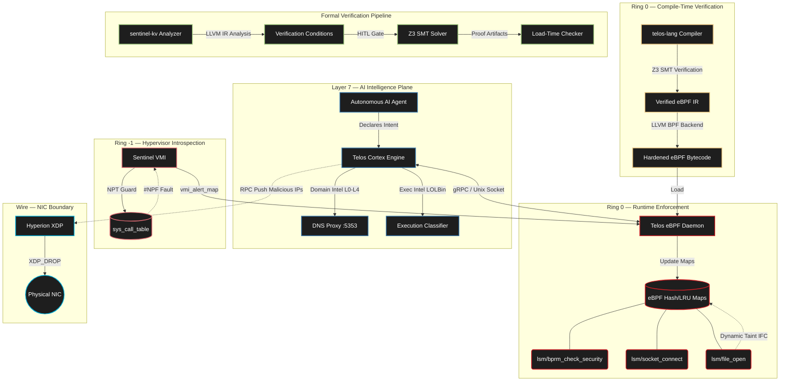

# Sentinel Stack

### Deterministic, Kernel-Native Defense from Ring -3 to Layer 7

<p align="center">
  
  
  
  
  
</p>

The Sentinel Stack is a unified, kernel-native defense quadrant designed to bridge the semantic gap between a program's compile-time intent and its runtime enforcement. It establishes a deterministic, cross-layer defense architecture spanning from Ring -3 hardware and firmware isolation up to Layer 7 MCP (Model Context Protocol) semantics.

---

## What is the Sentinel Stack? (The Simple Version)

Traditional security tools trust the operating system. If a rootkit takes over the kernel, the security tool is blind. If an AI agent is tricked by a prompt injection, containerization cannot stop it from exfiltrating secrets using trusted system binaries like `curl`.

**The Sentinel Stack eliminates these assumptions.** It deploys independent enforcement at every hardware and software layer simultaneously:

- **Below the firmware** — Hardware-enforced System Management Mode (Ring -2) policies and Intel ME (Ring -3) interdiction neutralize low-level persistent threats.
- **Below the kernel** — A hypervisor introspection engine monitors the OS from Ring -1. Even a fully compromised kernel cannot detect or disable it.
- **Inside the kernel** — eBPF-LSM hooks intercept every `execve()`, `connect()`, and `file_open()` system call, enforcing taint-aware Information Flow Control.
- **At the network card** — XDP programs drop malicious packets at wire-speed before the Linux network stack even sees them.
- **At compile time** — An LLVM-based policy-carrying code compiler and Z3 formal verification perform SMT-backed bounded correctness validation before deployment.
- **In the verification pipeline** — LLVM IR static analysis with SMT-backed memory safety checks and ring-aware attestation policies enforce deterministic trust.

If an AI agent reads `/etc/shadow` and then tries to `curl` the data to an external server, the Sentinel Stack kills the network connection inside the kernel **before the context switch completes**. If a rootkit modifies `sys_call_table`, the hypervisor detects the hardware page fault and flags the PID for wire-speed network isolation. This architecture prevents exfiltration through monitored execution paths.

> [!IMPORTANT]
> The Sentinel Stack assumes the host kernel is compromised. It relies on **out-of-band enforcement** and **hardware-backed immutability** rather than standard, in-band host telemetry. Security is enforced from a higher privilege level than the attack surface.

---

## Architecture



## Sentinel Distributed Kubernetes Pivot

Sentinel is deployed as a **Kubernetes DaemonSet**, leveraging a **multi-container sidecar pattern** to ensure zero-trust separation of concerns while maintaining deep systems integration via shared volumes and local UNIX sockets.

### 1. K8s Context Mapping
The Go daemon (`telos_daemon`) natively embeds `k8s.io/client-go`. We implemented an informer to stream Pod metadata from the API server. By parsing `/sys/fs/cgroup/kubepods.slice/.../cri-containerd-<ID>.scope`, the daemon securely maps individual eBPF inode numbers strictly to Kubernetes Pod namespaces, enabling high-fidelity SIEM logging and context-aware dropping.

### 2. Sidecar Containerization
- **`telos-daemon`:** Executes as a privileged `hostPID` and `hostNetwork` sidecar. It holds the root capability to pin eBPF maps to `/sys/fs/bpf` and mount the `hostPath` audit logs.
- **`telos-cortex`:** Runs as an isolated Python 3.10 slim sidecar that connects to the Daemon via the `/var/run/telos.sock` shared `emptyDir` volume for out-of-band Domain Classification.

### 3. Hyperion XDP L7 DNS DPI
The legacy standalone XDP binary was fully absorbed into the `telos_daemon`. The Daemon dynamically monitors the host's networking namespace for active CNI interfaces (`veth*`, `flannel*`) and attaches the `XDP_DROP` program on the fly during pod churn. To parse variable-length DNS QNAME payloads at wire-speed without crashing the eBPF Verifier, we bypassed the `E2BIG` state explosion limits using strict $O(N)$ linear unrolled loops and bitwise masking (`offset = i & 0xFF`), mathematically guaranteeing safe Ring-0 bounds execution.

### 4. Cross-Process IPC Taint Tracking
Advanced adversarial payloads leverage Inter-Process Communication (IPC) to pass execution to benign, high-privilege sidecars. Sentinel counters this using cluster-wide infection tracking across UNIX Domain Sockets:
- **BPF Local Storage (`SK_STORAGE` & `TASK_STORAGE`):** Mathematically eliminates kernel memory leaks and lock contention by binding the taint flags directly to the lifecycle of the kernel's socket and task structs.
- **BTF-Native Inheritance (`lsm/socket_sock_rcv_skb`):** When a clean server reads from a tainted socket, the inheritance hook securely passes the taint to the receiving process, extracting the newly infected Kubernetes `cgroup_id` dynamically to inform the Python Cortex engine.

---

## Architectural Interoperability Matrix

| Execution Layer | Sentinel Component | Primary Technology & Enforcement | Strategic Objective |
|:------|:------|:------|:------|
| Ring -3 (Co-processor) | [`sentinel-smm/src/mei`](sentinel-smm/src/mei/) | HECI Kprobes LKM / MKHI | Ring 0 host↔ME telemetric monitoring, administrative HECI interdiction |
| Ring -2 (Firmware) | [`sentinel-smm`](sentinel-smm/) | UEFI DXE / ASM / x86 MSRs | Out-of-band System Management Mode sandboxing, SPI flash defense |

| Ring -1 (Hypervisor) | [`sentinel-vmi`](sentinel-vmi/) | AMD-V / NPT Guard / ARMv8 EL2 | Out-of-band Hypervisor Introspection, memory monitoring |
| Ring 0 (Compile) | [`sentinel-cc`](sentinel-cc/) | LLVM / Policy-Carrying Code | Compile-time intent validation, Deep CFI, ASLR-aware enforcement |
| Ring 0 (Runtime) | [`telos-runtime`](telos-runtime/) | eBPF-LSM | Intent correlation, Information Flow Control (IFC), and Taint Tracking |
| Ring 0 (Runtime) | Sentinel RT | Seccomp / eBPF / io_uring | Host Intrusion Detection System (HIDS), Citadel recursive tracking |
| Wire / Physical NIC | [`hyperion-xdp`](hyperion-xdp/) | XDP / eBPF | Wire-speed network drop and proxy enforcement |
| Compile-time | [`telos-lang`](telos-lang/) | Rust / LLVM / Z3 SMT | Intent-to-eBPF compiler with formal verification |
| Verification | [`sentinel-kv`](https://github.com/nevinshine/sentinel-kv) | LLVM IR / Z3 / Ed25519 | Static memory-safety analysis, ring-aware attestation |

---

## Project Maturity

This repository spans multiple deeply technical domains, ranging from production-grade Linux primitives to experimental hardware-level defense mechanisms. Components are classified by their current level of implementation and testing depth:

| Component | Status | Description |
|:---|:---|:---|
| **telos-runtime** | Advanced prototype | Deep eBPF-LSM integration with daemonset orchestration and cross-process taint propagation. Extensively tested. |
| **hyperion-xdp** | Functional | Layer 7 wire-speed drops, verifier-safe unrolled loops. Integrated directly into the telos-daemon. |
| **sentinel-vmi** | Experimental | AMD-V/ARMv8 Ring -1 hypervisor introspection. Relies heavily on exact hypervisor states and VM configuration. |
| **sentinel-smm** | Early research | Intel ME and UEFI SMM firmware interdiction. High risk of hardware instability. |
| **telos-lang** | Research compiler | Rust/LLVM-based SMT verification compiler proving intent-based properties. Proof of concept. |
| **sentinel-kv** | Prototype | Static memory-safety analyzer for LLVM IR with HITL verification gating. |

---

## Components

### sentinel-smm — Ring -2 / Ring -3 Supervisor

Operates natively at the hardware and firmware levels to isolate the OS from opaque sub-systems. Enforces strict policies in System Management Mode (Ring -2) to sandbox SMI handlers, and interdicts Intel Management Engine (Ring -3) traffic via HECI Kprobes.

**Key capabilities:**
- Hardware-enforced `#GP` exception traps for privileged operations (MSRs, I/O)
- Cryptographically verified `SentinelSharedBuffer` for SPI flash hardware lockdown
- S3 Boot Script Table hook to guarantee `FLOCKDN` and `PR0` registers persist across ACPI sleep states
- Ring -3 HECI interdiction via LKM Kprobes to block restricted Intel ME client GUIDs (AMT, ICC)
- Neutralizes Ring -2 rootkits (e.g., SinkClose) prior to OS and Hypervisor execution

### sentinel-vmi — Ring -1 Hypervisor Introspection

Operates below the OS at the AMD-V / ARMv8 EL2 hardware layer. Monitors guest memory from outside the trust boundary. Protects `sys_call_table` using Nested Page Table write-protection. Detects rootkit modifications via hardware `#NPF` faults and propagates malicious PIDs to the rest of the stack via `vmi_alert_map`.

**Key capabilities:**
- Raw memory introspection via `kvmi_read_physical()`
- BTF-first semantic gap bridging for `task_struct` parsing
- NPT Guard with multi-region integrity baseline (IDT/GDT/LSTAR/kernel_text)
- Cross-layer eBPF map bridge to Telos Runtime and Hyperion XDP
- Heki IPC with Drawbridge cryptographic nonce verification

### sentinel-cc — Ring 0 Policy-Carrying Code Enforcement

Enforces compile-time intent at runtime to eliminate the semantic gap between compiler intent and kernel execution. Embeds security policies directly into the binary and validates execution validity via a cryptographic trust chain and eBPF fentry hooks.

**Key capabilities:**
- Compiler-generated whitelists of valid syscalls, CFI ranges, and library imports
- Embedded cryptographic trust via Ed25519 signatures
- Kernel enforcement via 19 eBPF fentry hooks + 5 fexit hooks
- Per-app attack surface reduction via call-graph BFS through libc
- Shadow stack CFI to detect ROP chains and stack smashing


### telos-runtime — Intent-Based AI Security

Enforces AI agent behavior through Natural Language Intent Declarations, eBPF-LSM syscall gates, and real-time Information Flow Control. Implements the Dual-Gate Architecture (Execution Gate + Network Gate) with cross-vector taint tracking. If a process touches sensitive files, all network access is permanently revoked (Network Slam).

**Key capabilities:**
- Kubernetes Native: Deploys as a zero-trust DaemonSet sidecar with `client-go` informer-driven cgroup-to-pod mapping.
- Deep Kernel IPC Taint Tracking: Propagates lateral movement infection trees across UNIX Domain Sockets using mathematically safe `BPF_MAP_TYPE_SK_STORAGE` and `TASK_STORAGE`.
- Dual-Gate kernel enforcement (`lsm/bprm_check_security` + `lsm/socket_connect`)
- Dynamic IFC with taint elevation and irreversible Network Slam
- Domain Intelligence Engine with 5-layer classification pipeline (L0-L4)
- LOLBin defense with per-intent execution allowlists
- `BPF_MAP_TYPE_LRU_HASH` for graceful eviction under fork-bomb loads
- Prometheus metrics on `:9094/metrics`

### hyperion-xdp — Wire-Speed Network Defense

XDP programs attached directly to the NIC driver drop malicious packets before `sk_buff` allocation. Fully integrated into the `telos_daemon` for dynamic attachment to CNI virtual interfaces (`veth*`, `flannel*`) during Kubernetes Pod churn. Provides structured M5 telemetry with 40-byte aligned events via `BPF_MAP_TYPE_RINGBUF`.

**Key capabilities:**
- Wire-speed `XDP_DROP` at the NIC driver receive path
- Layer 7 DNS DPI: Verifier-safe $O(N)$ linear byte-scanning for QNAME malicious domain exfiltration.
- Dynamic interface discovery: Automatically binds to active K3s container interfaces upon pod creation.
- Deep payload inspection with signature matching
- Stateful per-flow tracking via `BPF_MAP_TYPE_LRU_HASH`
- Telos RPC bridge on `:9095/block`
- C/Go struct binary parity (40 bytes, verified by unit tests)

### telos-lang — Formally Verified Policy Compiler

Rust-based compiler translating high-level security intent into Z3-verified eBPF bytecode. Uses Hoare Logic and BitVector analysis to mathematically prove policy safety before kernel deployment. Implements a dual-target LLVM pipeline generating both x86_64 host code and BPF kernel sandboxes in a single pass.

**Key capabilities:**
- Dual-target IR pipeline (x86_64 host + BPF kernel)
- Static Information Flow Control lattice (`Secret<T>`, `Public<T>`, `Tainted<T>`)
- Z3 SMT formal verification proving verifier-compatible memory constraints
- Fail-closed bootstrap via `llvm.global_ctors` injector
- Cryptographic boundary casting (SHA-256, AES-GCM declassification)
- Hyperion XDP bridge code generation

### sentinel-kv — Security-Focused LLVM IR Analyzer

Static LLVM IR analyzer designed for strict attestation, determinism, and ring policy enforcement in kernel and bare-metal environments. Combines SMT-backed memory safety analysis with signed attestation validation and a human-in-the-loop (HITL) verification gate.

**Key capabilities:**
- LLVM IR memory safety analysis (allocation provenance, bounds checking, UAF, double-free)
- Ring-aware fail-closed policies (`ring0`, `ring-1`, `ring-2`)
- Ed25519 signed attestation with nonce binding, replay counters, and freshness checks
- HITL verification gate (AI proposes, human approves, Z3 verifies)
- Interactive TUI and machine-readable JSON outputs for CI/SIEM
- C and Zig attestation bridge backends

---

## The Threat Model

The Sentinel Stack addresses three distinct threat classes simultaneously:

**1. Kernel Compromise (Ring 0)**
- Traditional eBPF/LSM tools are untrustworthy once the kernel is compromised
- `sentinel-vmi` operates from Ring -1, below the compromised OS
- Hardware NPT write-protection enforces `sys_call_table` immutability
- The feedback loop for Ring -1 errors is a kernel panic and hard reboot — no error messages, no debugger

**2. AI Agent Exfiltration (The Great Exfiltration)**
- Compromised agents use signed LOLBins (`curl`, `wget`, `base64`) to exfiltrate data
- Standard telemetry cannot distinguish this from legitimate system administration
- `telos-runtime` eBPF-LSM hooks enforce kernel-level taint tracking and IFC
- Network Slam is irreversible for the lifetime of the process

**3. Network-Level Threats (Wire Speed)**
- Malicious domains resolved to IPs and pushed to XDP blacklist
- `hyperion-xdp` drops packets at the NIC driver before `sk_buff` allocation
- Sub-microsecond enforcement with zero kernel network stack involvement

---

## Getting Started

### Prerequisites

- **Kernel:** Linux >= 5.15, compiled with `CONFIG_DEBUG_INFO_BTF=y`
- **Go:** >= 1.21
- **Python:** >= 3.10
- **Clang/LLVM:** >= 11 (for eBPF compilation and CO-RE)
- **Rust:** >= 1.70 (for telos-lang and sentinel-kv)
- **bpftool:** For BTF/vmlinux generation
- **Z3:** SMT solver for formal verification

### Deterministic Build

The entire architecture is orchestrated via the root Makefile:

```bash
git clone --recursive https://github.com/nevinshine/sentinel-stack.git
cd sentinel-stack

# Generate the unified kernel header (required for CO-RE)
bpftool btf dump file /sys/kernel/btf/vmlinux format c > include/vmlinux.h

# Build all components deterministically
make all
```

**Build outputs:**

```
bin/
├── bpf_lsm.o          # Telos eBPF kernel module
├── telos_daemon        # Telos Go eBPF loader + IPC + Prometheus
├── hyperion_ctrl       # Hyperion XDP controller
└── telosc              # Telos-Lang verified compiler
```

### Individual Builds

```bash
make telos-runtime      # Build Telos Runtime only
make hyperion-xdp       # Build Hyperion XDP only
make telos-lang         # Build the compiler only
make clean              # Clean all artifacts
```

---

## Quick Start Demo

### 1. Start the Full Stack

```bash
# Terminal 1: Start Telos Runtime
cd telos-runtime && sudo -E telos start

# Terminal 2: Start Hyperion XDP
cd hyperion-xdp && sudo ./bin/hyperion_ctrl -iface lo -telemetry
```

### 2. Test Execution Gate (LOLBin Defense)

```bash
# Terminal 3: Run the demo payload
cd telos-runtime
export TELOS_CORTEX_AUTH_TOKEN="same-token-used-by-cortex"
python3 demo_payload.py
```

**What happens:**
1. Agent declares intent: _"I need to download a file from the server"_
2. `curl` executes successfully (authorized)
3. `nc` is **BLOCKED** — never part of the declared intent
4. `cat /etc/passwd` is **BLOCKED** — sensitive file access denied

### 3. Test Information Flow Control (Network Slam)

```bash
sudo -E python3 demo_ifc.py
```

**What happens:**
1. Agent reads `/etc/shadow` — eBPF elevates taint to `CRITICAL`
2. Agent tries `curl evil.com` — **Network Slam** kills the connection with `-EPERM`
3. Data never leaves the machine

### 4. Test Wire-Speed XDP Bridge

```bash
# Query a typosquatted domain through Telos DNS proxy
python3 -c "
from dnslib import DNSRecord
q = DNSRecord.question('githuh.com')
r = q.send('127.0.0.1', 5353, tcp=False, timeout=5)
print(DNSRecord.parse(r))
"
```

**Watch Hyperion Terminal:** `[TELOS-RPC] Added 97.107.140.81 to XDP Blacklist`

### 5. Test the Compiler (Formal Verification)

```bash
cd telos-lang/telosc

# Compile and formally verify a policy
sudo cargo run tests/hello_world.telos
```

**What happens:**
1. Parser extracts intent blocks and IFC annotations
2. Z3 SMT solver proves all eBPF basic blocks are memory-safe
3. Dual-target LLVM emits x86_64 host + BPF kernel code
4. `.init` bootstrap loads eBPF sandbox before `main()`
5. If kernel rejects the sandbox, binary self-aborts (fail-closed)

> [!CAUTION]
> When Hyperion is attached to a physical NIC, XDP drops are **irreversible** at the hardware level. Blacklisted IPs experience 100% packet loss. Use loopback (`-iface lo`) for testing.

### Hyperion XDP IPC API

Hyperion exposes a Unix Domain Socket at `/tmp/hyperion.sock` for dynamic, wire-speed policy updates from the Cortex AI engine.

**JSON Schema:**
```json
{
  "command": "<add_signature | block_ip>",
  "payload": "<signature_string | ipv4_address>"
}
```

**Examples:**
*   `{"command": "block_ip", "payload": "10.0.0.5"}` — Immediately drops all packets from `10.0.0.5` at Layer 2.
*   `{"command": "add_signature", "payload": "malware"}` — Injects a new deep-packet signature into the eBPF policy map.

---

## Performance & Benchmarks

Benchmarked under **10 Million operations** across **100 concurrent threads** on native Linux:

| Syscall Hook | Native Baseline | Sentinel Guarded | Overhead |
|:-------------|:---------------:|:----------------:|:--------:|
| `file_open` (IO) | 26.51 us | 28.79 us | +2.27 us (+8.5%) |
| `bprm_check_security` (Exec) | 6431 us | 6625 us | +193 us (+3.0%) |
| `socket_connect` (Network) | 195.57 us | 199.46 us | +3.89 us (+1.9%) |

> [!NOTE]
> Sub-microsecond map lookups. Zero-copy ringbuf telemetry. Production-grade overhead at enterprise scale. The LLM is **never** in the hot path — all ALLOW and DENY decisions are purely deterministic O(1) lookups.

### The Ring Buffer Saturation Envelope

Sentinel includes an automated [Benchmark Suite](tests/benchmarks/README.md) (`tests/benchmarks/`) to deterministically measure the performance delta between the Ring 0 data plane and the User-Space control plane.

When subjected to volumetric network floods, the eBPF kernel enforcement scales linearly at wire-speed, blocking 100% of malicious attempts. The user-space daemon relies on an asynchronous 256KB Ring Buffer to extract telemetry without locking up the host CPU. The Benchmark Suite automatically generates a **Saturation Curve** demonstrating that security enforcement remains perfectly intact while the observability telemetry gently flattens out, proving that the host CPU is protected under heavy fire.

---

## Monorepo Structure

```
sentinel-stack/
├── sentinel-vmi/          # Ring -1 Hypervisor Introspection (C)
│   ├── src/               #   VMI engine, NPT guard, task walker, bridge
│   ├── include/           #   Shared headers (sentinel_vmi.h, task_offsets.h, vmi_alert_map.h)
│   ├── tests/             #   Per-phase unit tests
│   └── scripts/           #   Kernel build, VM setup, test runner
├── telos-runtime/         # Ring 0 Intent-Based AI Security (Go + Python + C)
│   ├── cortex/            #   AI Intelligence Engine (Cortex gRPC server)
│   ├── telos_core/        #   eBPF kernel module (bpf_lsm.c) + Go loader
│   ├── shared/            #   gRPC protocol definitions
│   ├── benchmarks/        #   10M-operation stress tests
│   └── tests/             #   Verification scripts
├── hyperion-xdp/          # Wire-Speed Network Defense (C + Go)
│   ├── src/kern/          #   XDP eBPF program (hyperion_core.c)
│   ├── src/user/          #   Go control plane (hyperion_ctrl)
│   ├── docs/              #   Telemetry specs, testing guides
│   └── benchmarks/        #   Performance test scripts
├── telos-lang/            # Formally Verified Policy Compiler (Rust)
│   ├── telosc/src/        #   Parser, typecheck, codegen (host + BPF + XDP)
│   ├── telosc/src/codegen/#   verify_smt.rs, bootstrap.rs, bpf.rs, xdp.rs
│   └── telosc/tests/      #   IFC, loops, declassify, intent test cases
├── sentinel-arm64/        # ARM64 cross-compilation stubs
├── include/               # Shared monorepo headers (vmlinux.h)
├── bin/                   # Unified build artifacts
├── tests/                 # Integration tests
└── Makefile               # Root build orchestrator (v1.0-rc1)
```

---

## Development

```bash
# Full deterministic build
make all

# Individual component builds
make telos-runtime
make hyperion-xdp
make telos-lang

# Clean everything
make clean

# Run Telos verification suite
cd telos-runtime/tests && bash verify.sh

# Run Telos performance benchmarks
cd telos-runtime/benchmarks && python3 lsm_bench.py

# Run Hyperion integration tests
cd hyperion-xdp && ./test_integration.sh

# Run Telos-Lang tests
cd telos-lang/telosc && cargo test

# Run Sentinel-KV analysis
cd sentinel-kv/skv-analyzer && cargo test
```

---

## License

MIT License — see individual component licenses.

---

<p align="center">
  <b>Sentinel Stack</b> — <em>Because every layer is a perimeter.</em>
</p>
