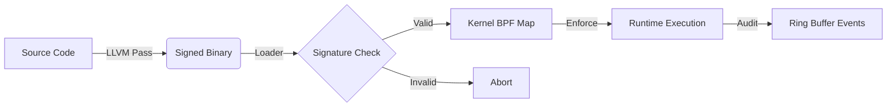

# Sentinel-CC: Policy-Carrying Code Enforcement

> **Status:** Experimental prototype (alpha)

**Sentinel-CC** is a security architecture that enforces compile-time intent at runtime. It correlates "what the compiler sees" with "what the kernel executes" by embedding security policies directly into the binary and determining execution validity via a cryptographic trust chain.

> [!IMPORTANT]
> **Core Concept: Policy-Carrying Code (PCC)**
> Traditional security tools rely on external, manually maintained policy files. Sentinel-CC inverts this model:
> 1. **Compiler-Generated Policy:** The compiler (LLVM Pass) analyzes the CFG to generate a precise whitelist of valid syscalls, CFI ranges, and library import lists.
> 2. **Embedded Trust:** Policy (`.sentinel`), CFI metadata (`.sentinel_cfi`), and import tables (`.sentinel_imports`) are cryptographically bound to the code via an **Ed25519** signature.
> 3. **Kernel Enforcement:** 19 eBPF fentry hooks + fork tracking refuse any syscall that doesn't match the signed policy.
> 4. **Per-App Attack Surface Reduction:** Call-graph analysis through libc whitelists only the syscall sites *reachable* from the binary's actual imports — not the entire library.
> 
> 

## Threat Model

Sentinel-CC defends against control flow hijacking (e.g., Return-Oriented Programming) and unauthorized syscall execution by enforcing compile-time intent at runtime.
**In Scope**: Code injection, syscall-number confusion, ROP chains, and execution from unauthorized execution regions (W^X violations).
**Assumptions**: The LLVM compiler pass runs in a trusted environment, the Ed25519 signing key is securely stored, and the Linux kernel eBPF verifier is intact.
**Out of Scope / Limitations**: JIT code (e.g., V8, JVM) and dynamically loaded plugins (via `dlopen`) generate syscall sites unknown at compile time. These require explicit dynamic loading flags (`--watch-dlopen`) or fall out of scope.

---

## Architecture & Trust Chain

The system establishes a continuous chain of trust from source code to runtime execution.



* **Compiler:** Injects `.sentinel` policy, `.sentinel_cfi` caller-range metadata, `.sentinel_imports` (external function list), and `.signature` placeholder. Detects inline `syscall`, `int $0x80`, obfuscated `.byte 0x0f, 0x05`, and 50+ libc wrappers.
* **Signer:** Signs `Hash(.text + .sentinel + .sentinel_cfi + .sentinel_imports)` with **Ed25519**.
* **Loader:** Verifies signature (with key-revocation checks) via **Linux Kernel Keyring**, performs **call-graph BFS through libc** to whitelist only reachable syscall sites, loads generalized CFI from `.sentinel_cfi`, and populates BPF maps.
* **Enforcer:** eBPF programs validate `RIP` at every security-sensitive syscall across **19 fentry hooks + 5 fexit hooks + 1 fork tracepoint** (25 total).
* **Auditor:** 256 KB ring buffer streams structured enforcement events to userspace in real-time.

### Enforcement Algorithm (eBPF Hot Path)

Every hooked syscall executes this decision tree inside the kernel. The hot path (ALLOW) requires **3 map lookups + 1 comparison** with zero tracing overhead.

```
syscall entry (fentry hook)
│
├─ target_pid_map[TGID] exists?
│   NO  → system_wide? → fallback_policy[NR] → ALLOW or DENY(FALLBACK)
│   YES ↓
│
├─ cgroup_filter? → cgroup_map[cgid] exists?
│   NO  → PASS (not in enforced cgroup)
│   YES ↓
│
├─ vma_map LPM lookup(RIP)
│   MISS → learn_mode? → emit LEARN, ALLOW
│          otherwise   → SIGKILL (unknown VMA — injected code)
│   HIT  → module_id, base_addr
│          ↓
│
├─ learn_mode? → record {offset → (mod_id, NR)} in learn_map → ALLOW
│   NO  ↓
│
├─ thread_policy_map[{tgid, tid}] → max_nr?
│   HIT → NR > max_nr? → DENY
│   MISS ↓
│
├─ policy_registry[module_id] → inner_policy_map
│   ↓
├─ inner_policy_map[RIP - base_addr]
│   MISS → SIGKILL (no policy for this offset)
│   HIT  → policy_value
│          ↓
│
├─ NR check: policy_value has CHECK_NR flag?
│   YES → actual_nr == expected_nr?
│          NO  → SIGKILL (NR_MISMATCH)
│          YES ↓
│   NO  ↓ (wildcard — skip NR check)
│
├─ shadow_cfi? → walk 8 stack frames
│   Any frame RIP not in vma_map? → DENY(SHADOW_FAIL)
│   All OK ↓
│
├─ CFI check: cfi_policy[offset] exists?
│   YES → bpf_get_stack() caller RIP in [func_start, func_end]?
│          NO  → SIGKILL (CFI_FAIL)
│          YES ↓
│   NO  ↓ (no CFI constraint)
│
└─ ALLOW (emit audit event if --audit)
```

**Key properties:**
- TGID check: O(1) hash lookup — non-monitored processes see zero overhead (or fallback enforcement in system-wide mode)
- VMA resolution: LPM trie lookup — handles ASLR without per-exec reconfiguration
- Policy check: O(1) hash lookup in per-module map — scales independently of policy size
- NR validation: Single compare — catches syscall-number confusion attacks
- CFI validation: Stack walk via `bpf_get_stack()` — validates caller identity
- Shadow stack: Up to 8-frame return address verification — detects ROP chains
- Thread isolation: Per-{tgid, tid} policy lookup — enables thread-level restrictions
- Learning mode: Zero-overhead profiling — records behavior without enforcement

## Repository Structure

```text
src/
├── compiler/           # LLVM Pass (The "Intention Extractor")
│   └── SentinelPass.cpp
├── common/             # Shared Definitions
│   └── sentinel_shared.h
├── kernel/             # eBPF Enforcer (The "Gatekeeper")
│   └── sentinel.bpf.c
└── runtime/            # Host Tools
    ├── loader.c        # Sig verify, call-graph analysis, BPF loader
    ├── sentinel_dump.c # Policy inspector (reads .sentinel* sections)
    ├── sentinel_tui.c  # Terminal dashboard (live event visualization)
    └── sign_tool.c     # Ed25519 Signing Utility
src/cli/
└── scc.sh              # Unified CLI (git-style command interface)
tests/
├── victim.c            # Phase 1 test (inline syscalls)
├── victim_phase2.c     # Phase 2 test (shared library / ASLR)
├── victim_cfi.c        # Call-Stack Validation test (caller validation)
├── victim_threaded.c   # Multithreading stability test
├── victim_fork.c       # Fork tracking test
├── victim_bench.c      # Syscall latency microbenchmark
├── attack_shellcode.c  # Red team: mmap RWX shellcode injection
├── attack_wxorx.c      # Red team: W^X mprotect violation
├── attack_rop.c        # Red team: ROP gadget reuse
├── attack_hidden_syscall.c  # Red team: syscall-number confusion
├── attack_ptrace.c     # Red team: ptrace injection
├── attack_memfd.c      # Red team: fileless malware (memfd_create)
├── attack_vm_writev.c  # Red team: cross-process write
├── attack_seccomp.c    # Red team: seccomp filter tampering
├── attack_sendmsg.c    # Red team: SCM_RIGHTS fd exfiltration
├── attack_dup2.c       # Red team: fd hijacking
├── real_httpd.c        # Real-world: forking HTTP server (44 syscall sites)
├── run_all.sh          # Automated test suite
└── red_team.sh         # Adversarial attack suite
docs/
├── threat-model.md     # Threat model & attack scenarios
├── architecture.md     # System architecture deep-dive
└── api-reference.md    # Section formats, BPF maps, CLI reference
man/
├── sentinel-loader.1   # Man page for the runtime loader
├── sentinel-sign.1     # Man page for the signing tool
├── sentinel-dump.1     # Man page for the policy inspector
├── sentinel-tui.1      # Man page for the terminal dashboard
└── scc.1               # Man page for the unified CLI
etc/
└── sentinel@.service   # systemd template unit for protecting binaries
Makefile                # Build system (30+ targets)
benchmark.sh            # Syscall latency + attack surface benchmark
```

## Building & Running

> [!NOTE]
> **Prerequisites**
> * **Clang/LLVM 15+**
> * **libbpf**, **libelf**, **libkeyutils**
> * **OpenSSL**
> * **bpftool**
> * Kernel with **BTF** support (`/sys/kernel/btf/vmlinux`)
> 
> 

### Quick Start with `scc`

The `scc` unified CLI provides a git-style interface to the entire toolchain:

```bash
make                        # Build everything
scc status                  # Check system readiness
scc build tests/victim.c -o victim   # Compile + instrument + sign
sudo scc run ./victim       # Run under eBPF protection
sudo scc ui ./victim_phase2 # Live TUI dashboard
sudo scc bench              # Run latency benchmarks
sudo scc test               # Full test suite
scc features                # Show all features
scc dump ./victim           # Inspect embedded policy
scc sign --fingerprint pub.pem # Show public key fingerprint
```

### Manual Build & Run

```bash
make clean && make
```

This builds the Compiler Pass, the Runtime Tools, and compiles+signs all victim binaries.

### 2. Setup Root of Trust

Sentinel respects the Linux Kernel Keyring. You must load the public key into your session keyring before execution.

```bash
# In production, this would be a builtin_trusted_key
sudo keyctl add user sentinel:pubkey "$(cat pub.pem)" @s

# --- OR: Use TPM2-backed Root of Trust ---
# Load key from TPM2/PKCS#11 URI (requires tpm2-tss-engine)
# export SENTINEL_TPM_URI="pkcs11:token=sentinel;object=pubkey;type=public"
sudo ./loader --tpm ./victim
```

### 3. Run the Enforcer

```bash
sudo ./loader ./victim
```

**Expected Output:**

```text
[Loader] Signature Verified. Integrity Confirmed.
[Loader] Parsed 2 policy entries from .sentinel (text_vaddr=0x...)
[Loader] BPF programs loaded and attached.
[Loader] Policy loaded. Detaching child (PID=...).
[SAFE] Logging system active.
```

### 4. Run with Audit Mode

Stream real-time enforcement events:

```bash
sudo ./loader --audit ./victim
```

**Audit Output:**

```text
[Audit] ALLOW PID=1234 TID=1234 SYS=1 RIP=0x4014f0 Off=0x4f0 Mod=1
[Audit] BLOCK PID=1234 TID=1234 SYS=1 RIP=0x401530 Off=0x530 Mod=1
```

> [!CAUTION]
> **Security Validation (Tamper Test)**
> Attempting to modify the binary (even by a single byte) will break the Ed25519 cryptographic binding.
> ```bash
> echo -n "X" | dd of=victim bs=1 seek=500 count=1 conv=notrunc
> sudo ./loader ./victim
> ```
> **Output:** `[FATAL] Signature Verification FAILED! Binary may be tampered.`

## Features

### Multi-Syscall Enforcement

The eBPF enforcer hooks **19 security-sensitive syscalls** + 5 fexit + 1 tracepoint (25 total):

| Hook | Syscall | NR | Purpose |
|------|---------|----|---------|
| `fentry/__x64_sys_write` | write | 1 | I/O enforcement |
| `fentry/__x64_sys_read` | read | 0 | I/O enforcement |
| `fentry/__x64_sys_openat` | openat | 257 | File access control |
| `fentry/__x64_sys_execve` | execve | 59 | Code injection prevention |
| `fentry/__x64_sys_mmap` | mmap | 9 | Memory mapping control |
| `fentry/__x64_sys_mprotect` | mprotect | 10 | W^X violation prevention |
| `fentry/__x64_sys_connect` | connect | 42 | Network policy |
| `fentry/__x64_sys_ptrace` | ptrace | 101 | Anti-debug (**unconditional block**) |
| `fentry/__x64_sys_memfd_create` | memfd_create | 319 | Fileless malware prevention |
| `fentry/__x64_sys_process_vm_writev` | process_vm_writev | 311 | Cross-process write (**unconditional block**) |
| `fentry/__x64_sys_prctl` | prctl | 157 | Process attribute control |
| `fentry/__x64_sys_sendmsg` | sendmsg | 46 | SCM_RIGHTS fd passing |
| `fentry/__x64_sys_dup2` | dup2 | 33 | File descriptor hijack |
| `fentry/__x64_sys_close` | close | 3 | Fd lifecycle control |
| `fentry/__x64_sys_ioctl` | ioctl | 16 | Device control |
| `fentry/__x64_sys_seccomp` | seccomp | 317 | Filter tampering (**unconditional block**) |
| `fentry/__x64_sys_bpf` | bpf | 321 | BPF map tampering (**unconditional block**) |
| `fentry/__x64_sys_unshare` | unshare | 272 | Namespace escape (**unconditional block**) |
| `fentry/__x64_sys_setns` | setns | 308 | Namespace injection (**unconditional block**) |
| `tp/sched/sched_process_fork` | fork | — | Child PID inheritance |

> [!NOTE]
> **Syscall Selection Rationale (19/335).**
> Sentinel-CC intentionally hooks only **security-sensitive syscalls** — those that enable code execution, memory permission changes, process manipulation, network access, file descriptor abuse, and kernel object tampering. The 3 new kernel object monitoring hooks (bpf, unshare, setns) prevent BPF map manipulation and namespace escape attacks. Hooking all ~335 x86-64 syscalls would add overhead with negligible security benefit. The 19 hooked syscalls cover the attack classes identified in the threat model (see [docs/threat-model.md](docs/threat-model.md)).

### Audit Ring Buffer

A 256KB ring buffer streams structured events (`audit_event`) to userspace in real-time. Each event contains: timestamp, PID, TID, syscall number, RIP, offset, module ID, and action (ALLOW/BLOCK/CFI_OK/CFI_FAIL).

#### JSON Audit Format (v4.1.0)

The loader supports JSON-formatted audit output with ISO-8601 timestamps, suitable for log aggregation pipelines:

```bash
sudo ./loader --audit --audit-format=json ./victim_phase2
```

```json
{"time":"2026-03-15T14:30:22.123456789Z","action":"ALLOW","pid":1234,"tid":1234,"syscall_nr":1,"rip":"0x4014f0","offset":"0x4f0","module":1}
```

#### Syslog Integration (v4.1.0)

Route enforcement events directly to the system log for centralized monitoring:

```bash
sudo ./loader --audit --audit-target=syslog ./victim_phase2
sudo ./loader --audit --audit-format=json --audit-target=syslog ./victim_phase2
```

Events are sent to LOG_DAEMON facility: BLOCK/CFI_FAIL/NR_MISMATCH at LOG_WARNING, ALLOW events at LOG_INFO.

### Policy Inspector (`sentinel-dump`)

Inspect the embedded Sentinel sections of any instrumented binary:

```bash
./sentinel-dump victim_phase2
```

```text
── .sentinel (Syscall Policy) ─────────────────────────────────
  Index  Site Address       Function           Offset     Syscall
  [  0]  0x00000000004004b7 0x00000000004004b0 0x000000f7 (any)
  [  1]  0x00000000004004c2 0x00000000004004b0 0x00000102 write (1)
  ...
  Total: 6 syscall site(s)

── .sentinel_imports (External Functions) ─────────────────────
  fclose              fopen               fprintf             printf
  Total: 6 import(s) (41 bytes)

── .signature ──────────────────────────────────────────────────
  Size: 64 bytes (Ed25519)
  Status: SIGNED
```

### Binary Signing & Revocation (`sentinel-sign`)

The signing tool supports advanced key management and revocation:

```bash
# Sign a binary
./sentinel-sign ./victim priv.pem

# Get public key fingerprint
./sentinel-sign --fingerprint pub.pem

# Revoke a key (adds to /etc/sentinel/policy.crl)
sudo ./sentinel-sign --revoke pub.pem "Compromised"
```

JSON output for tooling integration:

```bash
./sentinel-dump --json victim_phase2 | jq '.sentinel | length'
```

### Systemd Integration (v4.1.0)

A template service unit enables `systemctl`-managed binary protection:

```bash
sudo make install-systemd
sudo systemctl enable sentinel@-usr-local-bin-myserver
sudo systemctl start sentinel@-usr-local-bin-myserver
```

Events go to both the journal and syslog for unified log management.

### Post-Syscall Auditing (`--fexit`) (v4.2.0)

fexit BPF hooks emit the return value after the kernel completes key syscalls (write, read, openat, mmap, connect):

```bash
sudo ./loader --audit --fexit --audit-format=json ./victim_phase2
```

```json
{"ts":"2026-03-06T10:00:01.123Z","action":"FEXIT","pid":1234,"tid":1234,"syscall_nr":1,"ret":42}
```

Useful for observability without affecting enforcement.

### Policy Hot-Reload (`SIGHUP`) (v4.2.0)

Send SIGHUP to the loader to re-read the binary's `.sentinel` section and update BPF maps in-place — no child restart needed:

```bash
kill -HUP $(pidof sentinel-loader)
```

### LD_PRELOAD Sanitization (v4.2.0)

The loader detects and strips `LD_PRELOAD`, `LD_LIBRARY_PATH`, and `LD_AUDIT` from the child's environment before `fexecve()`. A warning is printed if any are detected.

### Terminal Dashboard (`sentinel-tui`) (v4.2.0)

Live TUI with aggregate counters, per-syscall breakdown, and color-coded event tail:

```bash
sudo ./loader --audit --audit-format=json ./victim_phase2 | ./sentinel-tui
```

### Configurable Enforcement Modes (v4.3.0)

The enforcer supports three enforcement modes, configurable via `--enforce=` or `--permissive`:

| Mode | Flag | Behavior |
|------|------|----------|
| **Kill** (default) | `--enforce=kill` | `SIGKILL` on violation — fail-closed |
| **Permissive** | `--permissive` or `--enforce=permissive` | Log violation as `PERMISSIVE` event but allow execution to continue |
| **Term** | `--enforce=term` | `SIGTERM` on violation — allows graceful shutdown handlers |

Permissive mode is essential for production rollouts: deploy Sentinel alongside existing workloads, observe violations in the audit log, and switch to kill mode once the policy is validated.

### Runtime `dlopen()` Monitoring (v4.3.0)

The loader periodically re-scans `/proc/<pid>/maps` (every 500ms) to detect libraries loaded via `dlopen()` at runtime. When a new `.so` is discovered:

1. The library's `.text` section is scanned for syscall instructions.
2. A new `inner_policy` map is created and populated.
3. The policy is registered in the `policy_registry` array-of-maps.
4. An `EVENT_DLOPEN_EXT` audit event is emitted.

Enable with `--watch-dlopen`. This addresses the previously documented limitation where `dlopen()`-loaded plugins were invisible to the call-graph BFS.

### Cgroup-Scoped Enforcement (v4.3.0)

For container and Kubernetes deployments, enforcement can be restricted to a specific cgroup hierarchy:

```bash
scc run --cgroup=/sys/fs/cgroup/system.slice/myapp.service ./myapp
```

The loader resolves the cgroup path to an inode and populates a BPF hash map. At runtime, the BPF enforcer checks `bpf_get_current_cgroup_id()` against the allowed set — processes outside the target cgroup are not subject to enforcement.

### Policy Format Versioning (v4.3.0)

The `.sentinel` section now includes a magic number (`0x53454E54` = "SENT") and format version for forward compatibility across toolchain upgrades. This ensures that policy files generated by newer versions of the compiler pass can be detected and rejected by older loaders rather than silently misinterpreted.

### Full Dependency Call-Graph Filtering (v4.4.0)

Call-graph-guided syscall filtering now applies to **all shared libraries**, not just libc. When any dependency library (e.g., `libpthread`, `libm`, `libssl`) is loaded, `trace_lib_callgraph()` performs BFS from the application's imports through the library's exported symbols, whitelisting only reachable syscall sites. Each library now reports its attack surface reduction independently:

```text
[Loader] Library 'libpthread-2.33.so' (mod=3): 4 VMA blocks, 12/67 syscall sites via call-graph (82.1% attack surface reduction).
```

### Runtime Policy Learning Mode (v4.4.0)

The `--learn` flag enables **passive profiling**: the BPF enforcer records all observed `{offset → (module_id, syscall_nr)}` tuples in a dedicated `learn_map` (8192 entries) without killing the process. Upon exit, the loader dumps the learned profile to `<binary>.learned.policy` for review and signing:

```bash
sudo ./loader --learn ./my_app
# After my_app exits:
# [Loader] Learning mode: wrote 47 entries to ./my_app.learned.policy
```

### Shadow Stack CFI (v4.4.0)

The `--shadow-cfi` flag activates kernel-side return address validation. At each syscall entry, the BPF enforcer walks up to 8 stack frames and verifies each return address falls within a known VMA (legitimate code). A single invalid frame triggers `EVENT_SHADOW_FAIL` and enforcement action. This detects **ROP chains** and stack smashing even when traditional CFI ranges are satisfied.

### System-Wide Fallback Enforcement (v4.4.0)

The `--system-wide` flag enforces a baseline syscall policy for **all processes**, not just the tracked binary. Processes not in `target_pid_map` are checked against a `fallback_policy` map containing ~35 safe syscalls (read, write, brk, mmap, exit, etc.). Unauthorized syscalls from any process trigger `EVENT_FALLBACK` enforcement.

### Kernel Attack Surface Report (v4.4.0)

The `--surface` flag generates a human-readable report mapping the binary's reachable syscalls to kernel subsystems (process, filesystem, network, memory, IPC, signal, device, security):

```text
=========================================================
  Sentinel-CC Attack Surface Report — ./victim
=========================================================
  Subsystem       Count  Exposure
  ----------      -----  --------
  filesystem         12  ############
  memory              4  ####
  process             3  ###
  signal              2  ##

  Attack surface: 21/350 NRs reachable (6.0% of kernel)
=========================================================
```

### Per-Thread Syscall Policies (v4.4.0)

The `thread_policy_map` allows per-thread syscall NR restrictions via `struct thread_key {tgid, tid}`. Worker threads can be restricted to a different set of syscalls than the main thread. The loader exposes `set_thread_policy()` for programmatic thread-level enforcement.

### Dynamic Library Load Enforcement (v4.4.0)

The `lib_allow_map` (FNV-1a hash → allowed) prevents unauthorized shared libraries from being loaded. Every library registered by the loader is hashed and added to the allow-list. Future BPF integration can deny `dlopen()` of unregistered libraries via `EVENT_LIB_DENY`.

### Multi-Arch CI (v4.2.0)

The CI pipeline now includes a Tier 3 ARM64 cross-compilation check that verifies the LLVM pass and BPF target work with `aarch64-linux-gnu`.

### Per-App Libc Filtering (Call-Graph Analysis)

The flagship v4.0.0 feature. Instead of whitelisting **all** ~435 syscall sites in glibc, Sentinel-CC now whitelists only those *reachable* from the binary's actual library calls.

1. The compiler emits `.sentinel_imports` — a null-terminated list of external functions the binary references (e.g., `fopen`, `printf`, `write`).
2. The loader builds a full symbol table of libc and loads its executable sections.
3. A **BFS** seeds from the imported symbols, scanning each function body for `E8` (relative CALL) opcodes, resolving targets to libc symbols, and recursing up to 24 levels deep.
4. Only syscall sites (`0f 05`) within *reachable* functions are whitelisted.

**Result:** A binary that calls 6 libc functions needs only 80 of the 435 syscall sites in glibc — an **81.6% attack surface reduction**.

```text
[Loader] Call-graph libc filtering: 6 imports → 618 reachable functions → 80 syscall sites
[Loader] Attack surface reduction: 80/435 libc sites whitelisted (81.6% reduction)
```

### Generalized CFI (`.sentinel_cfi` Section)

CFI policy is no longer hardcoded. The compiler emits a `.sentinel_cfi` section containing `{site_addr, func_addr}` pairs for every instrumented syscall site. The loader:
1. Reads `.sentinel_cfi` from the binary.
2. Looks up each function's size from the ELF symbol table.
3. Installs `cfi_policy` map entries: `offset → {func_start, func_end}`.

This makes CFI work automatically for any binary — no manual `policy_gen.py` needed.

### Obfuscated Syscall Detection

The compiler pass now detects attempts to hide syscall instructions inside inline assembly using `.byte` encoding:

```c
// All of these are now caught:
__asm__(".byte 0x0f, 0x05");           // hex
__asm__(".byte 15, 5");                 // decimal
__asm__("\x0f\x05");                    // escape sequences
```

Detected via regex analysis of inline asm strings. Emits a compile-time WARNING.

### Key Rotation & Revocation

```bash
make key-rotate    # Revoke current key → generate new keypair → re-sign all binaries
make key-revoke    # Revoke current key only (adds fingerprint to revocation list)
```

- Revoked keys are stored as SHA-256 fingerprints in `/etc/sentinel/revoked_keys`.
- The loader checks the revocation list before accepting any signature.
- Supports comments (`#`) in the revocation file.

### System-Wide Installation

```bash
sudo make install          # Installs sentinel-loader, sentinel-sign, sentinel-dump to /usr/local/bin
                           # Installs pub.pem to /etc/sentinel/
sudo make install-systemd  # Installs systemd template service unit
sudo make install-man      # Installs man pages
sudo make uninstall        # Removes installed files
```

### Dynamic `.sentinel` Parsing

The loader reads the binary's own embedded policy instead of hardcoding offsets. The `.sentinel` section contains an array of `{ void *site, void *function, int64_t syscall_nr }` entries that the compiler pass generated.

### Dynamic Libc Symbol Resolution

Instead of hardcoding offsets, the loader:
1. Finds the libc path from `/proc/PID/maps`
2. Opens libc's ELF and reads `.dynsym` + `.symtab`
3. Resolves `write`, `read`, `__write`, `__read`, etc. offsets dynamically

This works correctly across different glibc versions and distributions.

### Signal Handling & Cleanup

The loader installs `SIGINT`/`SIGTERM`/`SIGHUP` handlers that:
- Kill the child process gracefully
- Destroy BPF programs (freeing kernel resources)
- Exit with proper status codes

### Comprehensive Syscall Detection (Compiler Pass)

The LLVM pass detects **50+ syscall patterns** plus obfuscated encodings:
- Inline `syscall`, `int $0x80`, ARM `svc #0`
- `.byte 0x0f, 0x05` and `\x0f\x05` obfuscations
- All major POSIX wrappers: `read`, `write`, `open`, `close`, `mmap`, `mprotect`, `execve`, `fork`, `connect`, `bind`, `socket`, `ptrace`, ...
- GNU glibc internal wrappers: `__write`, `__libc_read`, `__sys_write`, ...

## Testing

### Automated Test Suite

```bash
sudo make test
```

This runs the full test suite including:
- **Prerequisite checks** (clang, bpftool, BTF, root)
- **ELF section integrity** (verifies .sentinel and .signature exist)
- **CLI tests** (`--help`, `--version`)
- **Signature verification** (valid binaries)
- **Tamper detection** (bit-flipped binary → rejection)
- **Unsigned binary rejection**
- **Phase 1/2/2.2/2.3 functional tests**

### Manual Tests

```bash
sudo ./loader ./victim              # Phase 1: Inline syscalls
sudo ./loader ./victim_phase2       # Phase 2: Shared libraries
sudo ./loader ./victim_cfi          # Phase 2.2: Call-Stack CFI
sudo ./loader ./victim_threaded     # Phase 2.3: Multithreading
sudo ./loader --audit ./victim      # Any test with audit output
```

## Project Status

> [!TIP]
> **Current Status: v4.5.0 — TPM2 Root of Trust, Signing Revocation, System-Wide Enforcement**
> * **Phase 1:** Static Binary Enforcement with Cryptographic Binding.
> * **Phase 2:** Full Real-World Runtime Security (ASLR, Shared Libs, CFI, Multithreading).
> * **Phase 3:** Syscall Number Binding + Fork Tracking + Ed25519 Migration.
> * **v4.0.0 - v4.3.0:** Per-app call-graph filtering, JSON audit, systemd integration, dlopen monitoring, cgroup scoping.
> * **v4.4.0:** Full dependency call-graph filtering, Learning Mode, Shadow Stack CFI, System-Wide Fallback.
> * **v4.5.0:** TPM2-backed Root of Trust support via OpenSSL STORE API, enhanced `sentinel-sign` with `--revoke` and `--fingerprint` commands, formal CRL support (`/etc/sentinel/policy.crl`).
> * **Performance:** 274 ns/syscall overhead (48.58%) — within low-latency threshold. Real HTTP server: ~0.7 ms/request under full enforcement (44 sites, 0 violations).
> * **Security:** 12/12 red-team attacks blocked + fork tracking. 3 unconditional-block hooks (ptrace, process_vm_writev, seccomp).
> 
> 

### Benchmark Results

#### Syscall Microbenchmark

| Metric | Value |
|--------|-------|
| **Workload** | 1M × `write(fd, "a", 1)` → `/dev/null` |
| **Warmup** | 1,000 iterations (discarded) |
| **Timer** | `CLOCK_MONOTONIC` (nanosecond precision) |
| **Native latency** | 564 ns/syscall |
| **Enforced latency** | 838 ns/syscall |
| **eBPF overhead** | 274 ns/syscall (48.58%) |
| **Threshold** | < 500 ns ✓ |

The hot path (ALLOW) performs zero tracing/audit — only 3 BPF map lookups + 1 comparison.

#### Real-World HTTP Server (real_httpd)

A forking HTTP server (`tests/real_httpd.c`) exercising the full network daemon syscall surface: `socket`, `bind`, `listen`, `accept`, `fork`, `read`, `write`, `open`, `close`, `fstat`.

| Metric | Value |
|--------|-------|
| **Instrumented syscall sites** | 44 |
| **External imports** | 29 |
| **CFI entries** | 44 |
| **Per-request latency (enforced)** | ~0.7 ms |
| **100 sequential requests** | 585 ms total |
| **Audit events (100 requests)** | 802 ALLOW, 0 DENY |
| **Audit syscall breakdown** | close(3): 430, read(0): 238, write(1): 128, openat(257): 62, mmap(9): 4, mprotect(10): 3 |

```text
[Loader] Signature Verified. Integrity Confirmed.
[Loader] .sentinel section: 44 entries (1056 bytes)
[Loader] Binary VMA: base=0x400000 (1 LPM blocks)
[Loader] Libc VMA: base=0x7f027c285000 (3 LPM blocks, after 26 steps)
[Loader] Policy loaded. Detaching child (PID=81367).
[httpd] Listening on http://127.0.0.1:8899
[httpd] Serving files from /tmp/sentinel_www

$ curl http://127.0.0.1:8899/
<html><body><h1>Sentinel-CC Protected Server</h1>
<p>This HTTP server is running under eBPF enforcement.</p></body></html>
```

#### Multi-Workload Summary

| Workload | Type | Syscalls | Overhead | Notes |
|----------|------|----------|----------|-------|
| `write` → `/dev/null` | Microbenchmark | 1M × write | 274 ns (48.6%) | Pure hook overhead |
| `real_httpd` (forking HTTP) | Network daemon | 44 sites | ~0.7 ms/req | socket/bind/listen/accept/fork/read/write |
| `victim_bench` getpid | Syscall baseline | 1M × getpid | ~315 ns (73%) | Includes NR validation |
| Attack surface (6 imports) | Call-graph BFS | libc filtering | 81.6% reduction | 80/435 sites whitelisted |

> [!NOTE]
> **Benchmark methodology:** All measurements taken on kernel 6.18, Clang 21.1, AMD Ryzen 7 (8 cores). Single-run numbers shown; for publication, run 30+ iterations and report mean ± stddev with 95% confidence intervals.

```bash
sudo make bench    # Run the benchmark
```

### Red-Team Attack Suite

```bash
sudo make red-team
```

```text
  ┌────────────────────────────────────┬──────────────┬───────────┐
  │ Attack Vector                      │ Sentinel     │ Since     │
  ├────────────────────────────────────┼──────────────┼───────────┤
  │ Binary Tampering                   │ ✓ Blocked    │ v1.0.0    │
  │ Unsigned Binary                    │ ✓ Blocked    │ v1.0.0    │
  │ Shellcode Injection (mmap RWX)     │ ✓ Blocked    │ v2.0.0    │
  │ W^X Violation (mprotect)           │ ✓ Blocked    │ v2.0.0    │
  │ ROP Gadget Reuse                   │ ✓ With CFI   │ v2.0.0    │
  │ Syscall-Number Confusion           │ ✓ Blocked    │ v3.0.0    │
  │ Ptrace Injection                   │ ✓ Blocked    │ v3.0.0    │
  │ Fileless Malware (memfd_create)    │ ✓ Blocked    │ v3.0.0    │
  │ Cross-Process Write (vm_writev)    │ ✓ Blocked    │ v3.0.0    │
  │ Seccomp Filter Tampering           │ ✓ Blocked    │ v4.0.0    │
  │ FD Exfiltration (sendmsg)          │ ✓ Blocked    │ v4.0.0    │
  │ FD Hijacking (dup2)                │ ✓ Blocked    │ v4.0.0    │
  │ Fork Tracking                      │ ✓ Tracked    │ v3.0.0    │
  └────────────────────────────────────┴──────────────┴───────────┘
  All expected attacks were blocked! ✓
```

### Shared Library Support (ASLR + Map-of-Maps)

* **ASLR Handling:** The loader dynamically parses `/proc/PID/maps` to find randomization offsets.
* **Map-of-Maps:** Determines policy based on which module (Main Binary vs Libc) is executing.
* **Dynamic Resolution:** Libc symbol offsets resolved from the actual libc ELF on disk.
* **Per-App Filtering (v4.0.0):** If `.sentinel_imports` is present, only reachable libc syscall sites are whitelisted via call-graph BFS. Falls back to full-text scan for legacy binaries.
* **ld.so coverage:** Dynamic linker syscall sites whitelisted as libc-relative offsets.

### Call-Stack CFI (Call-Stack Validation)

Enforces **Control Flow Integrity** by validating not just *where* a syscall happens, but *who called it*.

* **Generalized CFI (v4.0.0):** The compiler emits `.sentinel_cfi` with `{site, function}` pairs. The loader resolves function sizes from the ELF symbol table and loads `cfi_policy` automatically — no manual policy generation required.
* **`cfi_policy` map:** Maps `syscall_offset → {caller_start, caller_end}`.
* **Stack Walking:** `bpf_get_stack(ctx, stack, sizeof(stack), BPF_F_USER_STACK)`.
* **Enforcement:** If caller RIP is outside the valid range → `SIGKILL`.

### Multithreading Stability

TGID-based PID tracking correctly covers all threads in a process, preventing race conditions during policy enforcement.

### Syscall Number Binding

The compiler pass identifies the *exact syscall number* each site intends to invoke (via 40+ libc wrapper mappings and inline asm register analysis), and encodes it into the `.sentinel` section. The eBPF enforcer validates at runtime:

* **Policy encoding:** Bit 32 = `CHECK_NR` flag, bits 0–31 = expected syscall number.
* **Runtime check:** If the *actual* syscall number (from the fentry hook) doesn't match the *expected* number in the policy, the process is killed with `NR_MISMATCH`.
* **Wildcard support:** Sites where the compiler cannot determine the number (e.g., glibc cancellation trampolines) use `nr=any` and skip the number check.

## Comparative Analysis

Sentinel-CC differs from existing enforcement mechanisms primarily in **policy generation**, not enforcement capability. The key insight: seccomp-bpf *can* enforce identical rules, but requires manually authored policies. Sentinel-CC automates this via compiler analysis.

| Mechanism | Policy Source | Granularity | Cryptographic Binding | Per-App Call-Graph | ASLR-Aware | Runtime Overhead |
|-----------|--------------|-------------|----------------------|-------------------|------------|-----------------|
| **Sentinel-CC** | Compiler-generated | Per-site + NR + CFI | Ed25519 ✓ | BFS through libc ✓ | LPM trie ✓ | ~274 ns/syscall |
| seccomp-bpf | Manual policy | Per-syscall NR | None | None | N/A | ~50–100 ns |
| AppArmor | Admin profiles | Path-based | None | None | N/A | ~100–200 ns |
| SELinux | Label policy | Type enforcement | None | None | N/A | ~150–300 ns |
| Landlock | Developer API | FS/net scoping | None | None | N/A | ~80–150 ns |
| Pledge/Unveil | Developer annotations | Syscall classes | None | None | N/A | ~50 ns |

**What Sentinel-CC uniquely provides:**

1. **Zero policy authoring burden.** The compiler extracts the policy from the code itself — no manual seccomp filters, no AppArmor profiles, no SELinux labels.
2. **Per-site enforcement.** Not just "this binary may call `write`" but "this binary may call `write` *only from offset 0x4f0 within function `handle_client`*."
3. **Cryptographic integrity.** The policy is signed with the code. Tampering with either breaks the signature.
4. **Per-app libc filtering.** Only libc syscall sites *reachable* from the binary's actual imports are whitelisted (81.6% reduction measured). seccomp cannot do this without manual analysis.

**What Sentinel-CC does not replace:** seccomp and LSM hooks are complementary. Sentinel-CC enforces *where* syscalls may originate; seccomp/LSM enforce *what arguments* they receive. A defense-in-depth deployment would layer Sentinel-CC with seccomp argument filtering.

## Limitations & Known Constraints

### JIT and Dynamic Code Generation

Sentinel-CC relies on compile-time analysis. Code generated at runtime — JIT engines (V8, LuaJIT, JVM HotSpot), `mmap(PROT_EXEC)` trampolines, or self-modifying code — produces syscall sites unknown to the compiler pass. These sites will have no policy entries and will be killed on first invocation.

**Scope:** This is inherent to the PCC model. Sentinel-CC targets ahead-of-time compiled C/C++ binaries (the majority of system daemons, network servers, and security-sensitive infrastructure). JIT-heavy workloads (browsers, language runtimes) are out of scope unless the JIT emitter is modified to register new sites dynamically.

### `dlopen()` and Runtime-Loaded Plugins

The call-graph BFS seeds from `.sentinel_imports` — the set of external symbols visible at link time. Libraries loaded via `dlopen()` at runtime (e.g., nginx modules, Python C extensions, PAM plugins) are not in this set.

**Mitigation (v4.3.0):** The `--watch-dlopen` flag enables runtime `/proc/<pid>/maps` scanning to detect newly loaded libraries and dynamically extend the policy. This covers the common case of plugin loading. However, the runtime scanner uses a full `.text` scan (not call-graph BFS), so attack surface reduction for dynamically loaded libraries is less precise than for statically linked ones. For plugin-heavy applications without `--watch-dlopen`, the loader's fallback mode (full libc text scan) can be used via the `--no-callgraph` flag.

### vDSO Syscalls

Certain frequently-called "syscalls" (`clock_gettime`, `gettimeofday`, `time`, `getcpu`) are implemented in the vDSO — a kernel-mapped shared library that executes entirely in userspace without entering the kernel. These never trigger `fentry` hooks and are invisible to Sentinel-CC.

**Impact:** Minimal. vDSO calls are read-only time/clock queries with no security implications. They cannot be weaponized for privilege escalation, code injection, or data exfiltration.

### Signal Handler Edge Cases

Signals (`SIGALRM`, `SIGUSR1`, etc.) can interrupt normal execution and invoke handler functions at unexpected points. If a signal handler executes a syscall, the RIP will be within the handler's code — which *is* covered by the compiler pass (signal handlers are statically compiled functions with known offsets).

**Caveat:** `sigreturn`-oriented programming (SROP) attacks that manipulate the signal frame to redirect execution are partially mitigated by CFI validation, but sophisticated SROP chains remain a known challenge for any CFI scheme.

### BPF Verifier Constraints

The eBPF verifier imposes complexity limits on BPF programs:
- **Stack depth:** `bpf_get_stack()` returns a limited number of frames (currently 8 frames × 8 bytes = 64 bytes in the CFI check).
- **Instruction limit:** 1M verified instructions per program (not a practical limit for Sentinel-CC's simple lookup logic).
- **Map nesting:** `ARRAY_OF_MAPS` has a nesting depth of 1 (sufficient for the current 2-level policy_registry → inner_policy design).

Deep call stacks (>8 frames) will truncate the CFI stack walk, potentially missing the true caller. In practice, the direct caller (frame 0) is sufficient for most CFI checks.

### Kernel Compatibility

Sentinel-CC requires:

| Requirement | Minimum | Notes |
|-------------|---------|-------|
| `CONFIG_BPF` | Kernel 4.1+ | Basic BPF support |
| `CONFIG_BPF_SYSCALL` | Kernel 4.4+ | `bpf()` syscall |
| `CONFIG_DEBUG_INFO_BTF` | Kernel 5.2+ | BTF type information |
| `fentry`/`fexit` hooks | Kernel 5.5+ | Trampoline-based BPF attachment |
| `BPF_MAP_TYPE_RINGBUF` | Kernel 5.8+ | Audit ring buffer |
| `tp_btf` tracepoints | Kernel 5.5+ | Fork tracking |

**Practical minimum: Linux 5.8+** with BTF enabled. Tested on kernel 6.18 (Fedora). Most major distributions (Ubuntu 22.04+, Fedora 36+, Debian 12+) ship kernels that meet these requirements.

To verify:
```bash
scc status   # Checks all prerequisites including BTF
```

### Policy Scalability

The per-module `inner_policy` hash maps have a default maximum of 4096 entries (`MAX_POLICY_ENTRIES`). For binaries with more than 4096 instrumented syscall sites, this limit must be increased at compile time. In practice:

| Binary | Syscall Sites | Within Limit? |
|--------|--------------|---------------|
| `victim` (test) | 2 | ✓ |
| `victim_phase2` | 6 | ✓ |
| `real_httpd` (HTTP server) | 44 | ✓ |
| Typical daemon (estimated) | 50–200 | ✓ |
| Large application (estimated) | 500–2000 | ✓ |
| Libc syscall sites (full scan) | ~435 | ✓ |

## Future Work

### Near-Term (Engineering)

- **Macro-benchmarks:** Instrument and benchmark real-world applications (nginx, Redis, SQLite) under Sentinel enforcement. Measure throughput (req/s), latency percentiles (p50/p95/p99), and CPU overhead with statistical rigor (30+ runs, confidence intervals).
- **Comparative evaluation:** Head-to-head performance and security coverage comparison against seccomp-bpf, Landlock, and AppArmor on identical workloads.
- **Artifact package:** Dockerfile + Zenodo archive for one-command reproducibility, following USENIX artifact evaluation guidelines.

### Medium-Term (Research)

- **BPF-LSM integration:** Use `SEC("lsm/...")` hooks where LSM semantics are more natural (e.g., `file_open`, `socket_connect`) while retaining fentry for syscall-site validation. This addresses the "why not LSM?" question.
- **`bpf_override_return` / errno mode:** Return `-EPERM` instead of `SIGKILL` for non-critical violations, enabling graceful degradation in production deployments.
- **ARM64 native enforcement:** Full `svc #0` instruction detection and aarch64 fentry hooks (currently cross-compilation only).

### Long-Term (Unified Defense)

- **XDP + Sentinel pairing:** Combine Sentinel-CC's syscall enforcement with XDP-based network packet filtering, creating a unified compiler-to-wire security pipeline where both system calls and network I/O are policy-governed.
- **Formal verification:** Lightweight formal model of enforcement completeness: $\forall$ syscall $s$: $\text{allowed}(s) \iff \text{offset}(s) \in \text{Policy} \land \text{nr}(s) = \text{expected}(s) \land \text{caller}(s) \in \text{CFI\_range}(s)$
- **Rust/Go support:** Validate the LLVM pass with `rustc --emit=llvm-bc` and Go CGo builds to demonstrate language generality.
- **Fuzzing the enforcer:** Syzkaller-style fuzzing of BPF map edge cases to identify verifier interaction bugs.

---

**Sentinel-CC v4.4.0** — @Nevin Shine (System Security Student) 2026